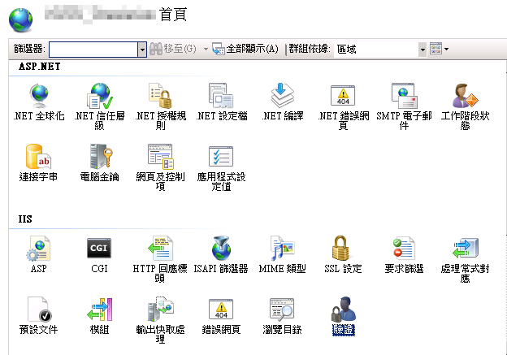
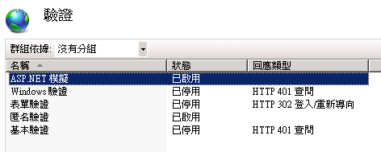
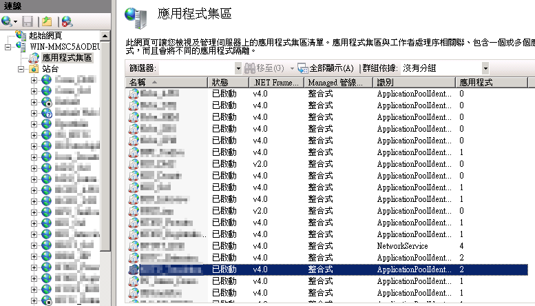
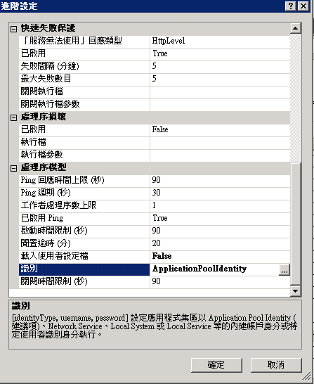
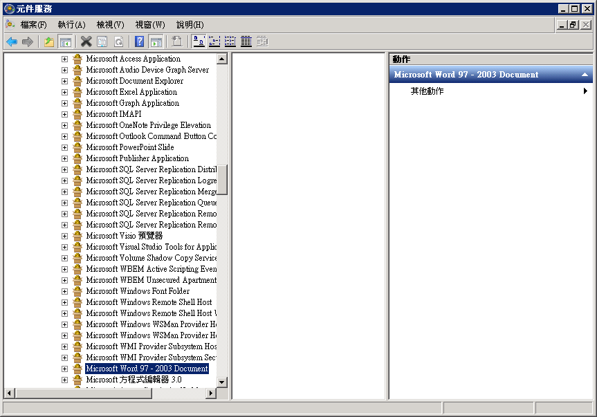
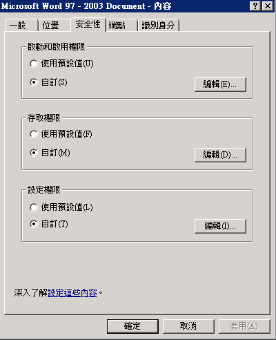
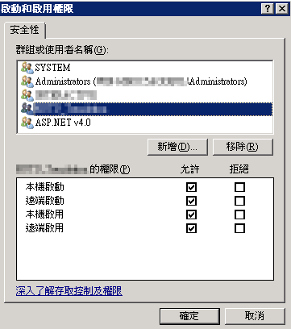

<h3>專案內容</h3>

以履歷表管理情境為例，示範如何將履歷資料以 Word 方式匯出。本專案提供兩種檔案匯出方式：

1. 完全使用 HTML 方式直接轉存匯出
2. 透過套印檔方式，將固定欄位的資料進行取代。無法事先制定格式的內容，以程式動態產生 (如: 表格內容)
 
 

<h3>使用套件</h3>

使用 [E-ICEBLUE Free Spire.Doc for .NET](https://www.e-iceblue.com/Introduce/free-doc-component.html#.WNI-qUaP8dU) (免費試用版) 、[OpenXML SDK](https://www.nuget.org/packages/OpenXMLSDK-MOT/) 進行 Word 檔案套印開發，並運用 [Microsoft.Office.Interop.Word](https://www.nuget.org/packages/Microsoft.Office.Interop.Word/) 及 [Aspose.Words](https://www.nuget.org/packages/Aspose.Words/) (免費試用版) 提供 Word 轉 PDF 檔案匯出功能服務 
Nuget 安裝指令: 
<pre><code>PM> Install-Package FreeSpire.Doc</code>
<code>PM> Install-Package OpenXMLSDK-MOT</code>
<code>PM> Install-Package Microsoft.Office.Interop.Word</code>
<code>PM> Install-Package Install-Package Aspose.Words</code></pre>

 Spire.Doc 文件與範例：[使用文件](https://www.e-iceblue.com/Tutorials/Spire.Doc/Spire.Doc-Program-Guide.html)
 免費版限制：

- 最多 500 個段落 (Paragraph)
- 最多 25 個表格 (Table)
- 若轉存成 PDF 或 XPS 檔案，最多僅會匯出前三頁內容

 

<h3>使用 Microsoft.Office.Interop.Word 佈屬 IIS 注意事項及流程</h3>
<a href="../MarkdownAttach/在IIS上存取使用Office COM元件.docx" alt="原始文件">Written and sponsored by Adrian Huang (2017-5-12)</a>

<h4>說明</h4>
在本機使用 Interop Word Excel 套件皆可正常運作，但架設到站台後便無法運作，發生錯誤訊息如: 
failed due to the following error: 80080005 伺服器執行失敗 
failed due to the following error: 80070005 存取被拒. 
此情形發生原因是因為在站台中，元件權限對 IIS 開放不足等造成的。  

<h4>設定流程</h4>
**1. 網站 Web.config 檔案設定中，加入使用者帳號**
  - 開啟專案 Web.config，並於 <system.web></system.web> 加入：
      
    <pre><code>&lt;identity impersonate="true" userName="your_ap_user_name" password="your_ap_password" /></code></pre>    
    username: ***AP登入帳號*** 
    password: ***AP登入密碼*** 
    ※如果站台有分前後台，兩邊的 Web.config 都需添加

**2. IIS 設定**
   - **於IIS管理員中，點選驗證**
    
    
     
   - **將 ASP.NET 模擬狀態設定為**已啟用****
     
   - **並檢查應用程式集區 → 所用專案 → .Net Framework 版本是否為**v4.0 整合式**。**
   - **並點選進階設定檢查識別身分是否為**ApplicationPoolIdentity**。**
   
    
**3. DCOM 設定使用 Office 元件之權限**
   - **執行指令 dcomcnfg，開啟元件服務**
   - **點選路徑電腦 → 我的電腦 → DCOM 設定**
   
     
   - **分別對 Microsoft Excel Application 與Microsoft Word 97-2003文件右鍵 → 內容**
   
     
   - **將安全性的「啟動和啟用權限」與「存取權限」勾選自訂，並開啟編輯視窗**
   
     
   - **新增 IIS 的應用程式集區名稱「IIS AppPool\集區名稱」並按下檢查名稱來選取，確認完成後將權限全允許。**
     
**4. Office文件存取之資料夾權限設定**
   - 設定操作暫存檔案的資料夾的存取權限
   - 安全性 → 權限加入**IIS_IUSRS**，並設定完全控制

**5. 設定 Desktop 資料夾**
     
    如果主機是 x86 作業系統與 32 位元 Office 或是 x64 作業系統與 64 位元 Office，則請在以下路徑加入 Desktop 的資料夾： 
    <pre><code>C:\Windows\System32\config\systemprofile</code></pre>
    如果是 x64 作業系統與 32 位元 Office，請在以下路徑加入 Desktop 資料夾： 
    <pre><code>C:\Windows\SysWOW64\config\systemprofile </code></pre>
    並將資料夾的權限加入 **IIS_IUSRS**，並設定完全控制
      
<h4>參考資料</h4>
- [在IIS上存取(Access)使用Office COM元件(Interop Word Excel)的設定流程(Configuration)](https://dotblogs.com.tw/v6610688/2015/02/19/iis_office_access_word_excel_com_interop_api_configuration)
- [The Solution of using ASP.NET Create Excel in Windows 2008 x64 with 80070005(在x64位元的系統上執行ASP.NET產生Excel遇到80070005 存取被拒解決方式)](http://ms-net.blogspot.tw/2012/11/the-solution-of-using-aspnet-create.html)

